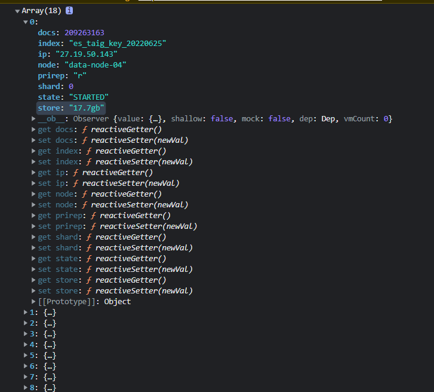
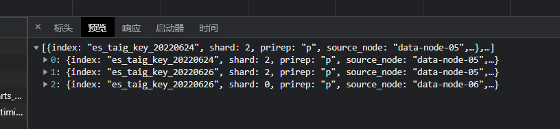
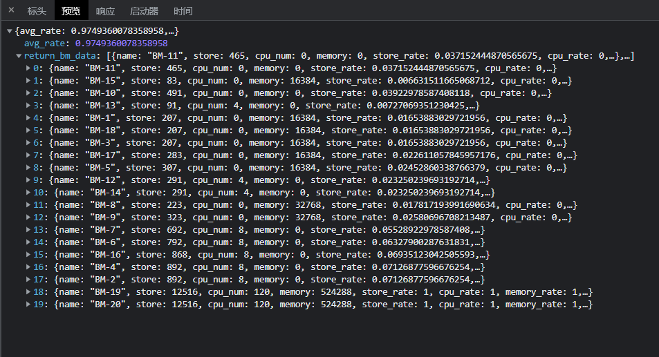

# 推荐使用 pycharm 打开项目至 /backend，因为已经内置 django 程序无需再在环境中下载

# Django方面

1. 建表与运行

```
// 进入 backend 文件夹，依次执行：
pip install pandas
pip install openpyxl

python manage.py runserver 127.0.0.1:8000 // 启动程序

```


# Vue方面

1. 运行

```
// 进入 /frontend 文件路径
yarn install // 下载依赖

yarn serve // 运行程序

// 在浏览器输入相应端口
```
# 接口文档

接口名     | 参数列表 | 返回参数列表                                                                              | 返回数据案例
-------- | ----- |-------------------------------------------------------------------------------------| ----- 
api/basic_info  | / | 一个对象数组(字段含义和原始提供 excel 表格数据一致)| 
api/balancing_node_steps  | / | 一个对象数组, 对象字段: index[索引名]、 shard[分片编号]、prirep[主副分片]、source_node[所在源节点]、dest_node[目标节点] | 
api/manage_resource  | / | 一个对象, 包含两个属性: avg_rate[表示平均利用率], return_return_bm_data [表示各物理机的属性]。                 | 
